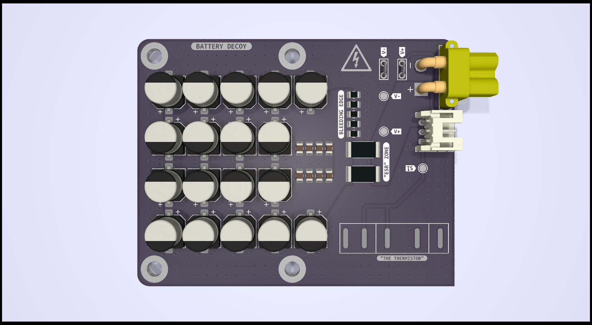

# BAT.UME.001

This is dummy battery.

## Elements

- Emulates ESR with two  resistors (2516)
- MLCC (0805) for transients handling
- Aluminum caps (6.3mm) for bulk capacity
- Bleed resistors array (0805)
- Potentiometer (WDX3) for emulating thermistor
